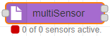
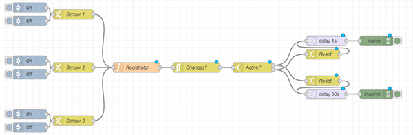
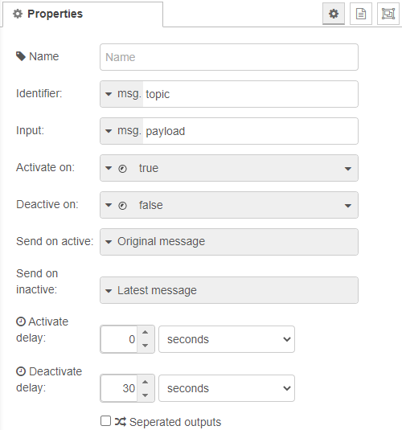
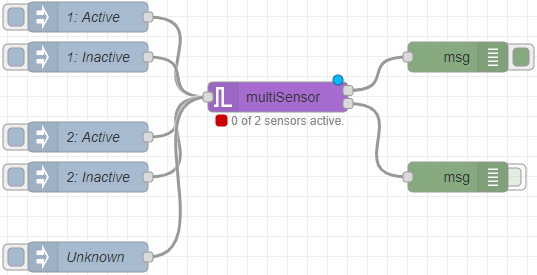

# node-red-multi-sensor
Binary motion sensor and activation state machine node for Node-red.

This node is a companion for any binary sensor (physical or virtual), storing all recieved sensors and their state and merge them into a single node.

  
**Fig. 1:** Node appearance

## Installation

### In Node-RED (preferred)
* Via Manage Palette -> Search for "node-red-multi-sensor"

### In a shell
* go to the Node-RED installation folder, e.g.: `~/.node-red`
* run `npm install node-red-multi-sensor`

## Usage

**Fig. 3:** Node explaination
To give an understanding on how the node works, we can take a look at this where you have three sensors that will enter a registration object that will store data about all sensors. Then it continues to check if any changes has been made to the state, if so, we check if we're active or inactive.
We need to ensure that the opposite timer is reset (if we use one).
This flow is merged down into a single node to ease and speed up the view.

  
**Fig. 1:** Node appearance
The node has two or three output channels *(by default, it uses two)*.
The last output channel here is the "status" channel, this one informs about the current state.
These states matches the structure:
 `{"id":x, "name":name}`

The different id's are:
* 0: Inactive
* 1: Active
* 2: Activating
* 3: Deactivating
* 130: Abort activation
* 131: Abort deactivation

### Node Configuration
The node configuration sets up how the sensor should react.

  
**Fig. 2:** Node properties

#### Name (optional)
*(Optional)* The name of this node. *(Will change the content of the node to the name)*

#### Identifier
The data field that should be used to uniquely identify a sensor.
Each sensor should have their own unique identifier that this node can use as an id to differentiate it from each other.

#### Input
The value to read and validate against the **Activate on** and **Deactivate on** values.
* If the input value doesn't match any of the two values, it will be ignored.
* If matches the **Activate on** value, it will use the **Identifier** to create a record with an active flag.
* If matches the **Deactivate on** value, it will try to find an already created record with the current **Identifier** to deactivate the flag.

#### Activate on / Deactivate on
The **input** value needs to match one of these fieds to trigger an action.
As explained for the **input** field, the activation and deactivion will only take place if matching one of these fields.

#### Send on active
As soon as a message where the **input** matches the **Activate on** value, will trigger the activation of the node.
The data specified in this field will then be sent, either directly or when **Activate delay** time has passed *(If not being deactivated before, then the activation will be canceled out)*.

#### Send on inactive
When the last active sensor record is received and its **input** value matches the **Deactivate on** value, the deactivation of the node will be executed.
The data specified in this field will then be sent, either directly or when **Deactivate delay** time has passed *(If not a sensor is being activated again, then the deactivation will be canceled out)*.

#### Activate delay / Deactivate delay
The delays are there to enable a latency between the actual event and the message being sent.
You can here choose if to directly send the message when activated/deactivated, or wait a specified amount.

#### Seperated outputs
If checked, there will be a different channel for the deactivation messages. Otherwise, if unchecked, the activation and deactivation messages will be sent through the same output channel.

### Input
The input `msg.payload` contains the **execution command** to the node.  
The value needs to be identical to the values you configured in the configuration dialog.

If a (string) value is set to the configuration attributes ***On/Off topic*** or ***Toggle topic***, the `msg.topic` property must contain the same string value to execute the command given in `msg.payload`.

An example `msg` contents is shown for ***On/Off topic*** = "onofftopic":

  
**Fig. 3:** Example `msg` when using topics

### Output
The input `msg` is forwarded to the output, if a valid switch command was detected.  
The configuration attribute ***pass through ON/OFF messages*** is taken into account.

These attributes can be of type
* string
* number
* boolean

### Node status
The node status signals:
- If the switch status is ***on*** it shows a green dot with the text **ON**.
- If the switch status is ***off*** it shows a red dot with the text **OFF**.

Initially it shows no state.

## Examples
***
**Remark**: Example flows are present in the examples subdirectory. In Node-RED they can be imported via the import function and then selecting *Examples* in the vertical tab menue.
***

### Example 1: Basic usage
This example shows the basic usage.  
The configuration simulates two different sensors and gives you the option to manually activate and deactive the sensors to try out the functionality.

[**example-1.json**](examples/example-1.json)  
**Fig. 4:** Basic usage example

## Version history
v0.1.0 Initial release

## Credits
- [TLacke](https://github.com/TLacke)